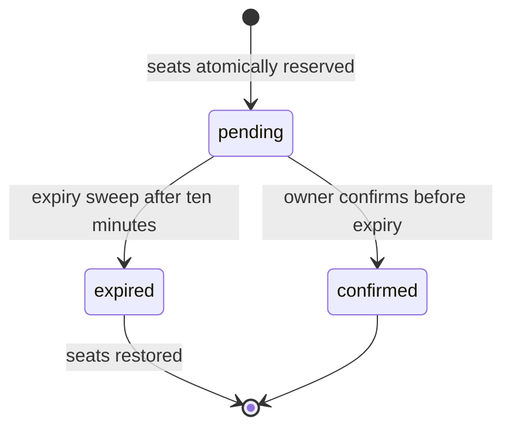

# Booking lifecycle

1. An authenticated user requests a quantity for an event.
2. The service conditionally decrements `availableSeats` only if enough capacity exists.
3. In the same MongoDB transaction, it creates a `pending` booking with an `expiresAt` value ten minutes in the future.
4. The owner may confirm while the booking remains pending and unexpired.
5. A periodic sweep claims expired pending bookings, marks each one `expired`, and returns its quantity to event inventory transactionally.

This protects the central overselling case: concurrent requests cannot both decrement the last seats because the conditional inventory update is atomic.

## Planned hardening

- Add idempotency keys to booking creation and confirmation.
- Integrate payment authorisation/capture, with a payment state machine.
- Add cancellation rules and compensating inventory updates.
- Move expiry processing to a single-purpose worker coordinated by a durable queue or distributed lock.
