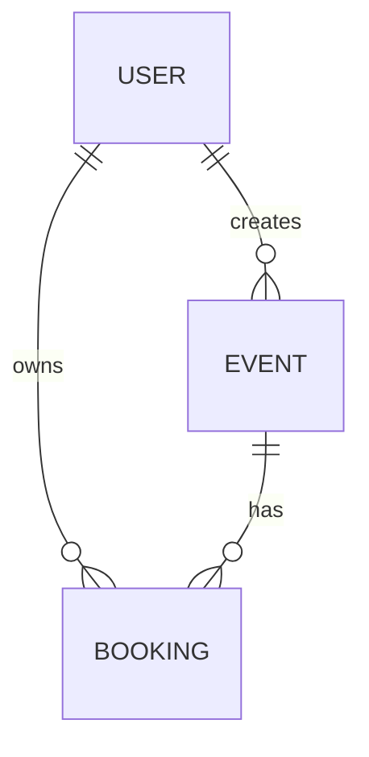

# Data model

## Collections

| Collection | Key fields | Notes |
| --- | --- | --- |
| `users` | `name`, unique `email`, hashed `password`, `role` | Password is excluded from ordinary queries |
| `events` | `title`, `venue`, `startsAt`, `totalSeats`, `availableSeats`, `createdBy` | `availableSeats` is the current sellable inventory |
| `bookings` | `user`, `event`, `quantity`, `status`, `expiresAt` | Status is pending, confirmed, expired, or cancelled |

## Inventory invariant

For an event, `availableSeats` must never fall below zero. A booking is created only when a conditional update proves enough seats remain. Both the decrement and pending booking creation occur within the same MongoDB transaction.

When a pending hold expires, the status change and seat restoration also occur in one transaction.

## Indexing roadmap

**Planned:** explicitly define indexes for event listing (`startsAt`), booking lookup (`user`, `createdAt`), expiry sweeps (`status`, `expiresAt`), and required uniqueness constraints. Measure query plans before adding or changing indexes.
