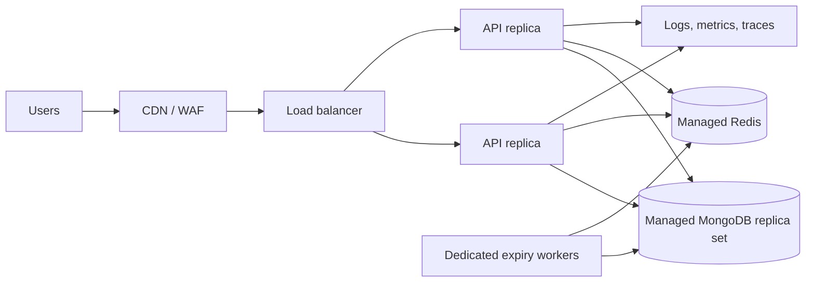

# Scaling and production infrastructure

## Current deployment

Docker Compose runs one API container behind one Nginx container, with OpenTelemetry Collector, Jaeger, Prometheus, and Grafana for local observability. MongoDB is external to the Compose stack. This is appropriate for development and small controlled environments, not a highly available public service.

## Production target

## Scaling strategy

- Keep HTTP APIs stateless; JWT authentication supports horizontal API replicas.
- Use a managed MongoDB replica set and transactions for inventory consistency. Monitor connection pools, slow queries, and replication health.
- Replace the in-process expiry timer with dedicated workers. Coordinate work with a durable queue or a Redis-backed distributed lock so each expiry task is processed once.
- Use Redis only when a measured need exists: queues, distributed rate limiting, short-lived caching, or locking.
- Add database indexes and paginate event and booking listings before data volume grows.
- Protect hot events with rate limits, idempotency keys, back-pressure, and load tests that simulate concurrent seat requests.

## Production checklist

- [ ] TLS, domain, CDN/WAF, and edge DDoS protections
- [ ] Managed MongoDB backups, restore testing, replica-set monitoring
- [ ] Secret manager; no secrets in Compose files, images, or logs
- [ ] CI: type-check, tests, dependency/security scan, image build
- [ ] CD: immutable image tags, rolling/canary deployment, rollback plan
- [ ] Central logs, dashboards, alerts, and on-call runbooks
- [ ] Distributed worker/queue for hold expiry
- [ ] API error contract, tests, rate limits, idempotency keys
- [ ] Data retention, privacy policy, audit logging, and access controls

## Capacity validation

Use load testing before releases to establish targets for p95/p99 latency, booking throughput, error rate, and database saturation. Test the highest-risk scenario: many concurrent bookings against the final remaining seats.
